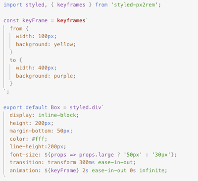
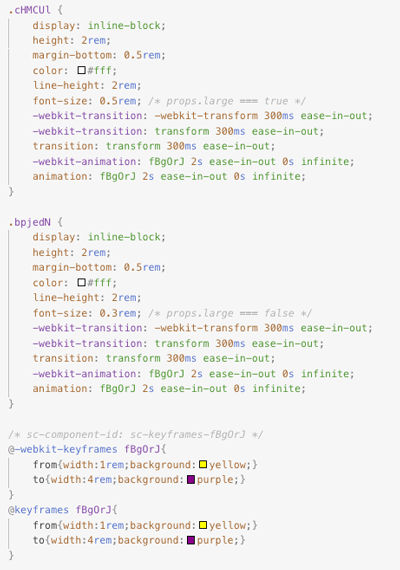
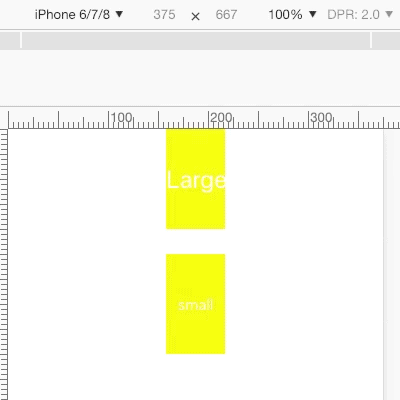

# styled-px2rem ✨

Extension of [styled-components](https://www.styled-components.com/) with features for convert `px` to `rem` units.

Check the documentation at [styled-components.com/docs](https://www.styled-components.com/docs) for more information about using styled-components!

## Contents

- [Important](#important)
- [Inspiration](#inspiration)
- [Features](#features)
- [Installation](#installation)
- [Usage](#usage)
- [Example](#example)

## Important

Based on <font color=#0e59d8>750px</font> design draft. 

We suposse `100px = 1rem` when screen width is `750px`, so `750px` would be `7.5rem`.

When the screen width is `375px`, like iPhone 6, the `font-size` in `html` tag should be `50px`, still, `7.5rem` would be `375px`, which equals to the screen width.

## Inspriation

Inspired by [styled-px2vw](https://github.com/hnzycfcfed/styled-px2vw), without which there would be no such the `styled-px2rem`.

## Features

- Suitable for mobile
- Supports [Adapting based on props](https://www.styled-components.com/docs/basics#adapting-based-on-props)
- Supports [Extending Styles](https://www.styled-components.com/docs/basics#extending-styles)
- Supports [.attrs constructor](https://www.styled-components.com/docs/api#attrs)

## Installation

yarn:
```bash
yarn add styled-px2rem
```
npm:
```bash
npm i --save styled-px2rem
```

## Usage

Just change module `styled-components` to `styled-px2rem`.

```javascript
import styled, { keyframes, ... } from 'styled-components';

const keyFrame = keyframes`
  0% {
    width: 100px;
    background: yellow;
  }
  100% {
    width: 400px;
    background: purple;
  }
`;

export default Box = styled.div`
  display: inline-block;
  height: 200px;
  margin-bottom: 50px;
  color: #fff;
  line-height:200px;
  font-size: ${props => props.large ? '50px' : '30px'};
  transition: transform 300ms ease-in-out;
  animation: ${keyFrame} 2s ease-in-out 0s infinite;
`
```
to

```javascript
import styled, { keyframes, ... } from 'styled-px2rem';

const keyFrame = keyframes`
  0% {
    width: 100px;
    background: yellow;
  }
  100% {
    width: 400px;
    background: purple;
  }
`;

export default Box = styled.div`
  display: inline-block;
  height: 200px;
  margin-bottom: 50px;
  color: #fff;
  line-height:200px;
  font-size: ${props => props.large ? '50px' : '30px'};
  transition: transform 300ms ease-in-out;
  animation: ${keyFrame} 2s ease-in-out 0s infinite;
`
```

## Example



Output



Screenshot



## License

Licensed under the MIT License, Copyright © 2019-present win-winFE, [https://github.com/win-winFE](https://github.com/win-winFE)

See [LICENSE](./LICENSE) for more information.

### Notes

This project is presented by [win-winFE Team](https://github.com/win-winFE). Please feel free to concat us if you have any questions. The following is our Wechat group QR-code.


